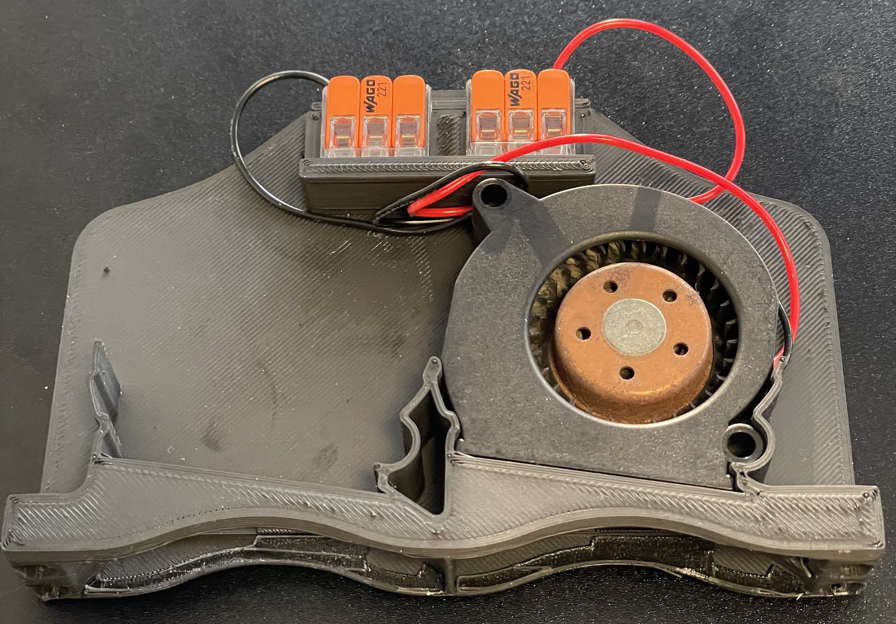

Nevermore Micro **Naked Mod for the PABST RLF-35 Fan mount**.

> Hey! RLF-35 fans are crazy expensive! They are literally $50 per fan.
>
> Buy them used/surplus in EU from www.maranos-shop.de, or world-wide on AliExpress. That way, you can get them for about $12-15. Still expensive, but will hopefully last long enough to become a more economical option than cheap 5015s that needs to be replaced.

.

This is a mod of the Pabst RLF-35 fan mount to remove all of the Nevermore Micro exterior casing and keep the mounting as minimalist as possible.
It has mounts for the Wago 221-413 Compact Triple Mount Connector - 2D and 3D models and some details available here:
[https://autodesk-fusion.partcommunity.com/3d-cad-models/sso/221-413-compact-splicing-connectors-for-all-conductor-types-3-conductor-terminal-block-wago?info=wago%2Fpg07%2Fserie221%2F0221-0413_0999-0962.prj&cwid=5116]

The Pabst fans require no modifications and if you are using the Wago 221-413 connectors no soldering is required.

You will need four 3x6 cylindrical magnets to attach the Nevermore Micro Carbon Air Filter Cartridge. If you intend to mount it to 2020 extrusions too will need 2x (M3x12 SHCS) and 2x (M3 2020 T-Nuts).
The Pabst RLF-35 fans are 24v so you will need to find an appropriate power source from your MCU Board or somewhere else. The fans are just a press fit into the mount and the Wago 221-413 connectors slide horizontally into their mounts - they are a tight fit.
