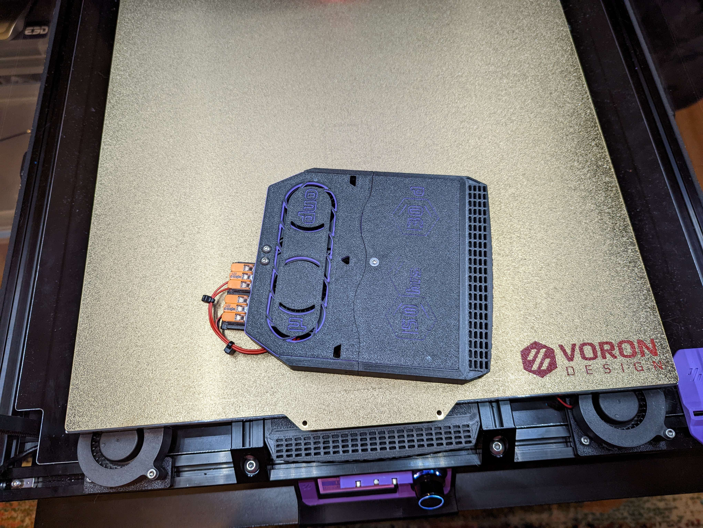
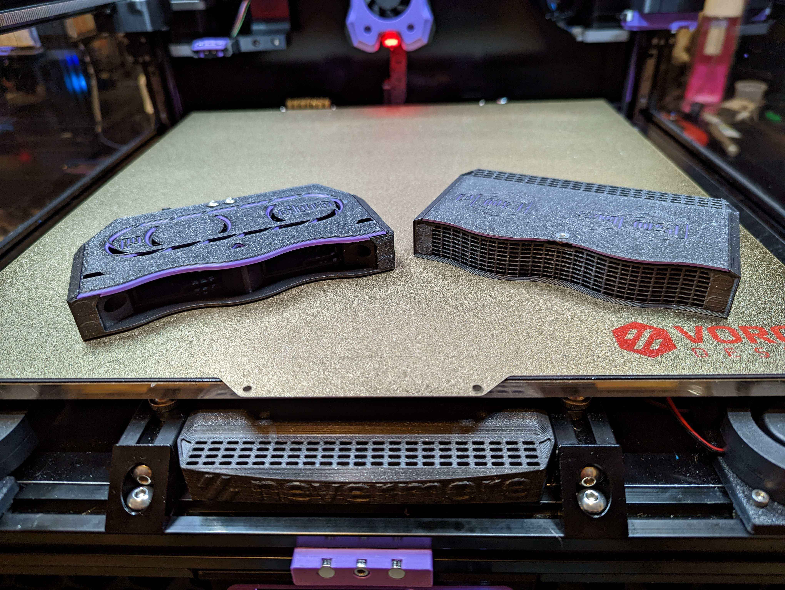
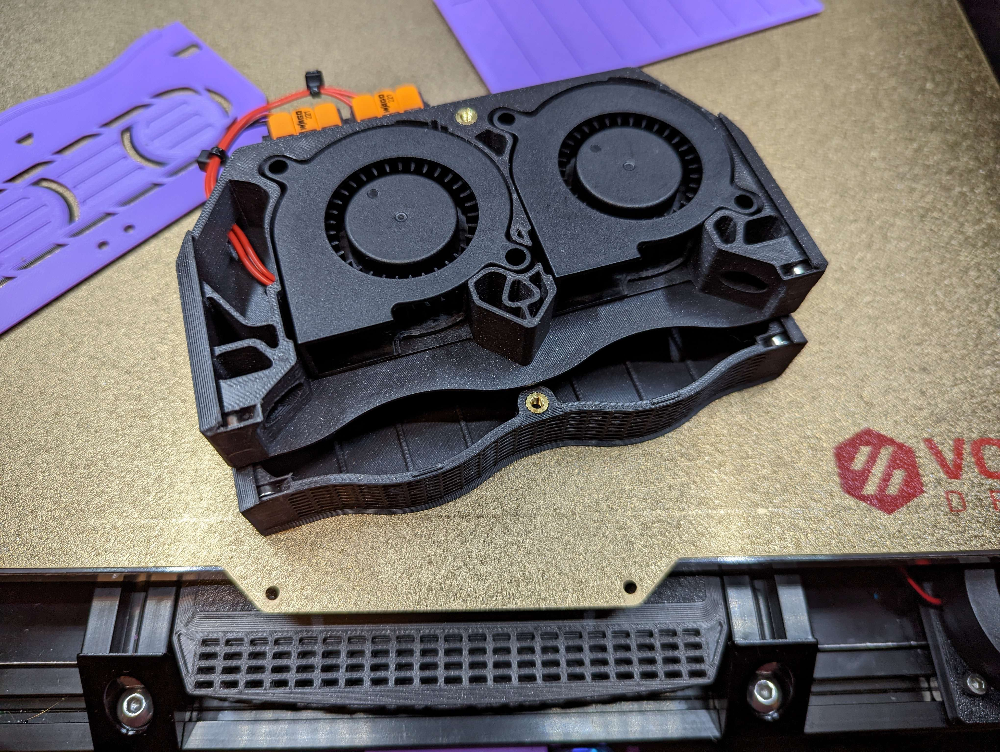

# Nevermore V5 Duo w/ Slide-in Magnets

I got tired of my magnets falling out, even after I had glued them, So I cooked up this mod.

After printing, just slide your magnets in from the top. Push the first magnet all the way to the bottom, and the second until you feel it slip into it's pocket. There's a whole on the bottom of the parts in case you need to remove the magnets.

There's two versions of the plenum, one with and one without a Wago mount on the back side. Use two 221-413 wagos for simpler, solder free wiring.

The cartrige uses the normal lids that can be found in the v2 folder. The plenum has a modified lid, so use the one here.

For extra cool points, print both lids with a color swap at about the 4th layer.

Regarding the two cartridges:
>Choose between regular and XL cartridge. XL is just 10mm longer, which can make a big difference in air flow.
>
>Choose XL for max carbon content and filter duration, and if you dont mind the fan (200Pa+) has to run faster/noisier. You probably have to use pellets instead of granular carbon too.
>
>Choose regular if you have granular carbon and/or a wekaer fan, and/or wish to have a more silent experience. Regular also allows for somewhat higher airflow, which could make a small difference compared to XL in chamber heat up times.

