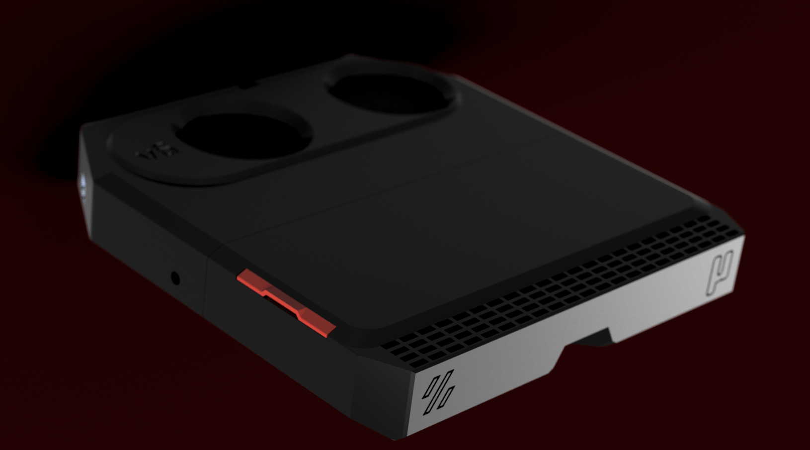
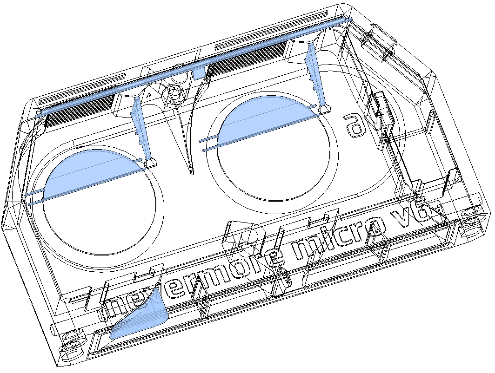
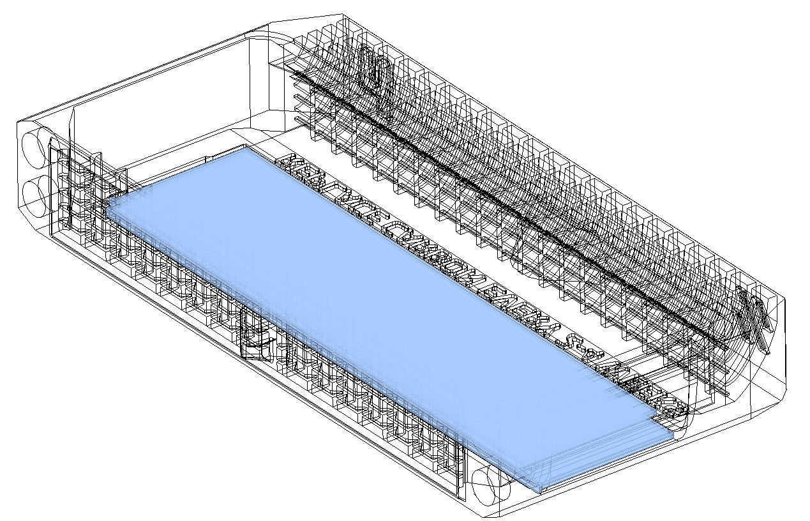
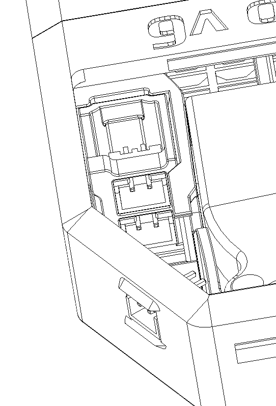
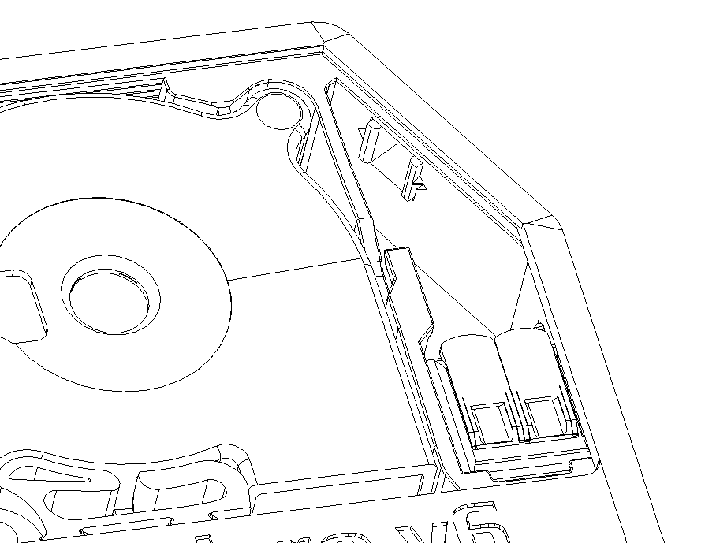

# Nevermore Micro V6

Nevermore Micro V6 is here! It is designed to supersede both the V4 and V5 duos, which will soon be considered legacy designs.

## What's New?

- **Intact 5015 Fans:** V6 now make use of fully intact 5015 fans, eliminating the need to cut the fan scroll or wires. This raises a concern: does it waste carbon if airflow from a small 15mm 5015 fan exhaust isn't spread over the entire 130mm filter surface? Yes, usually - however, we have overcome this challenge through use of evasees and vanes to efficiently spread the airflow within the small plenum space. This means all the carbon receives airflow immediately, without requiring any fan modifications.

- **Enhanced Heat Tolerance:** Unlike its predecessors, V6 can tolerate higher levels of heat. The V4 and V5 had thinner lids that could bend or warp, especially when subjected to temperatures above 100°C under a heated bed. This sometimes resulted in broken or damaged units. However, the V6 is beefed up to address this issue. With a thicker frame, structured vanes, and lids strategically placed away from the heat source, the chances of melting a Nevermore Micro are significantly reduced.

- **Improved Airflow:** V6 boasts superior airflow. We have achieved this by optimizing the printing direction, which allows for built-in seals. Say goodbye to air leaks between the cartridge and the plenum! Furthermore, the air intakes have been redesigned to accommodate increased airflow. Now, it can process the chamber volume of a 250 Voron in just 30 seconds, and a larger 350 in approximately 2 minutes.

- **Reduced Noise:** V6 generates less noise compared to the V5, thanks to a redesigned air intake.

- **Compatibility:** V6 can be printed on any machine, including on a Voron v0 on which a v5 duo previously wouldnt fit. Yet the size is the same, its dark sorcery.

- **Sleek Design:** V6 not only performs exceptionally but also looks awesome. It features a novel jalousie lid design with no bolts, allowing for convenient one-handed carbon swaps. Gone are the days of dealing with annoying bolts or latches when swapping carbon. Rest assured, this design remains super secure. You have to try it to believe it! Jalousie demo [here](https://youtube.com/shorts/sSmVfhcDKrI?feature=share).

## Print material and settings
- Designed and prototyped with ABS materials. Any material that is heat resistant enough for the installation spot will likely work, but brittle material (i.e regular PLA) should be avoided for the jalousie slider and the spring fan fasteners.
- Made for standard voron settings. 0.2 mm layer height needed for supports to line up right, and 0.4-0.5mm line width for optimal mesh printing. 5 walls recommended for jalousie structural integrity, otherwise its pretty sturdy regardless.
- **JALOUSIE** can be break if your slicer settings interferes with the intended extrusion path. A suggestion from @Haldamir is to print it with 0 bottom solid, 1 top solid layers, 5 perimeters and 0.4 extrusion width. Also 90 degrees infill angle, so the 3rd layer is printed in this orientation.
**Avoid** bottom horizontal expansion so that there are no large gaps between the parallell length-wise extrusion lines (built in gaps in the bottom and second layer forces the slicer to print in a length-wise paralell pattern. Ideally, you want these gaps to fuse slightly for greatest strength).
  Some users has reported going **slow** for the first three layers improves the structural rigidity, as it gives more time for the layers to fully fuse. If your jalousie is prone to crack, try slowing down to 40mm/s and perhaps raise the **temp** slightly for better fusing. There is also a "thin" jalousie that might be a better fit for stiffer materials. It has bend layers that are 0.4mm instead of 0.6mm, which paradoxically will make a jalousie prone to cracking with _bending_ hold up better.

## BOM and Installation

### Support Removal

Before installation, there are a few support pieces that need to be removed:

**Plenum:**
- A long bridge along the top of the cartridge.
- The two triangular pillars extending to the fan tab slot from the area around the fan intakes.
- The top portion of the two fan intakes.
- On the bottom right evasee/side bolt mount slot as viewed from the front.

**Cartridge:**
- The lid/jalousie area has a single support piece. Be cautious when removing it, ensuring not to damage the jalousie sliding path. If the support is fused, use an X-Acto knife if necessary.

### Plenum

#### Electronics

**Required:**
- 2x 5015 blowers (compatible with Delta, Honeybadger, Gdstime, and Winsin. Sunons might fit but the intake holes may not line up perfectly). It is recommended to use blowers with good static pressure (>150Pa).

**Wiring Options:**
1. **Single JST-XH 2-pin**: Solder both fan wires to a single JST-XH 2-pin connector and connect it to the plenum port.
2. **Triple JST-XH 2-pin**: Print the [2xJST_Holder.stl] insert to create a triple JST-XH 2-pin port. Connect the fans without cutting fan wires by daisy-chaining the 2 extra JST connectors to the plenum JST port. Note that for thicker and longer fan wires (like Gdstime), the wiring space may need to be completely filled with wire.
3. **Dual WAGO 221 2-pin connectors**: Cut the fan wires, twist the fan wires together (12V bundle + GND bundle), and use WAGO connectors (One WAGO for 12v bundle, and another WAGO for GND bundle) as wire extensions. Print the [Wire_connector.stl] that fits the plenum JST port. Insert the power wire from your printer and connect it to the corresponding WAGO socket. Lastly, insert the WAGO connectors into their slots.

**TRIPLE-JST and WAGO**

#### Magnets

**Required:**
- 4x 6mm wide and 3mm deep magnets (also 4x magnets on the cartridge side, totaling 8 magnets).
**Note:** Take care when installing the magnets. A common issue is getting polarity wrong.

### Plenum Wiring and Lid Install

#### Back Extrusion Mounting

For the V0 1515 version or Trident 2020 version:
- Insert 2x M3x4x5 heat inserts, one in the back slot after lid installation, and one to secure the lid fully after snap fitting it.
- Use an extrusion T-nut.
- Seat [2020_Frame_Connector.stl] _OR_ [1515_Frame_Connector.stl] into the extrusion T-nut with an M3x6mm SHCS.
- Slide the plenum over the extrusion connector and connect the pieces with one M3x16 SHCS from the front side of the plenum.

#### Bed Extrusion Mounting

For the V2 2020 version (or sometimes the Trident 2020 bracket):
- Insert 1x M3x4x5 heat inserts, to secure the lid fully after snap fitting it (or both inserts as per above if you plan on using one back, and one side mount)
- 2x extrusion T-nuts.
- 1x m3x16 SHCS (left side mount when viewed from top/exhaust)
- 1x m3x20 SHCS (right side mount mwhen viewed from top/exhaust)
- Bolt the V6 to an extrusion t-nut on both side of the filter when mounting under the bed on a v2. 
**Note:** Bed doesnt have to be removed; connect the wires and bolt the plenum at the front of the bed, then loosen the bolts by half a turn allowing you to slide it in to position. Once in the right position, tighten it gently with a ball type driver.

### Cartridge

#### Magnets

**Required:**
- 4x 6mm wide and 3mm deep magnets (also 4x magnets on the plenum side, totaling 8 magnets).

#### Jalousie Sliding Lid Installation

The jalousie slider can be printed in any non-brittle yet rigid material. ABS, ABS+, Nylons, PETG, and Tough PLA are suitable options. However, avoid using brittle PLA or TPU.

For the first installation, **heat the jalousie slider slightly** (for instance, by placing it on the 3D printer's heated bed just below the glass transition temperature for a minute or two). Then, insert it from the top, ensuring the matching orientation, and push it in a few millimeters at a time. The critical moment is the first bend on the first insert, so **provide support and help it bend on the opposite side of insertion to prevent cracking or damaging the sliding path**. Once inserted, slide it in and out a few times to smooth out any surface imperfections that may hinder smooth operation. Lubrication should not be necessary but can be an option if desired.

## Support My Work

If you find my work helpful, consider [buying me some filament 🖍️](https://www.buymeacoffee.com/nevermore3d).
## For more information and documentation, visit our [GitHub page](https://github.com/nevermore3d).
