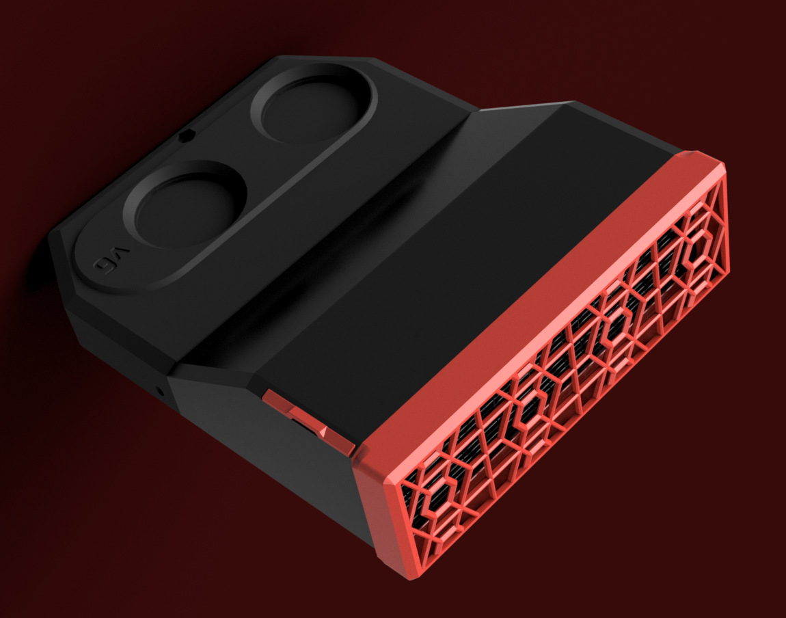
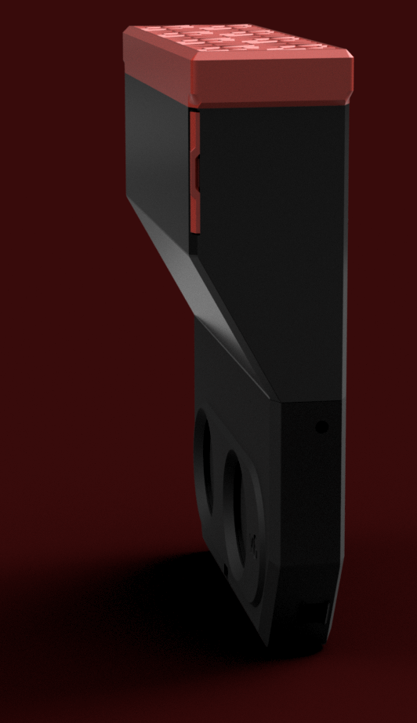
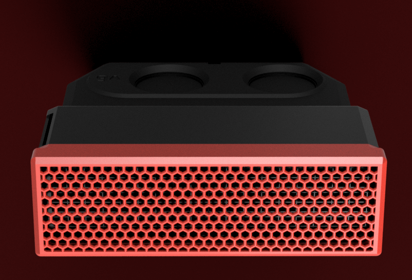

# Nevermore Micro - XL?!
This cartridge is double the thickness of a regular cartridge, and wont fit under a voron v2 bed. It does however fit along a panel on any machine with at least 42 mm of space between the panel and bed. The extra height allows the installation of a Xiaomi Mijia G1 [HEPA filter](https://s.click.aliexpress.com/e/_EGPsFBt) (same as on Nevermore Stealthmax), of the size 130x40x8mm.

Nevermore Micro V6 XL HEPA

Nevermore Micro V6 XL HEPA

Nevermore Micro V6 XL HEPA

